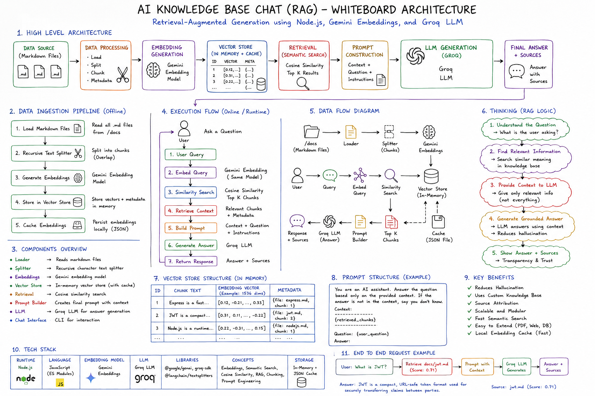

# 📚 AI Knowledge Base Chat (RAG)

> **Learning Retrieval-Augmented Generation (RAG) by building the entire
> pipeline from scratch.**


------------------------------------------------------------------------

# Why I Built This

This project was built to understand **how modern Retrieval-Augmented
Generation (RAG) systems actually work internally**, instead of relying
on high-level AI frameworks.

Rather than treating RAG as a black box, I implemented every stage
manually---from loading documents to chunking, embedding generation,
semantic retrieval, prompt construction, and answer generation.

The goal was not to build the most feature-rich chatbot, but to deeply
understand the engineering behind production AI systems.

This repository represents the **RAG phase** of my AI Engineering
learning roadmap.

------------------------------------------------------------------------

# Learning Objectives

Instead of simply calling an LLM API, I wanted to understand:

-   Document ingestion
-   Recursive text chunking
-   Embeddings
-   Vector representations
-   Semantic Search
-   Cosine Similarity
-   Retrieval Pipelines
-   Prompt Construction
-   Context Grounding
-   Hallucination Reduction
-   Embedding Caching
-   Modular AI Architecture

------------------------------------------------------------------------

# Current Status

✅ Markdown Loader

✅ Recursive Chunking

✅ Gemini Embeddings

✅ Embedding Cache

✅ In-Memory Vector Store

✅ Cosine Similarity Search

✅ Semantic Retrieval

✅ Prompt Builder

✅ Groq LLM Integration

✅ Interactive CLI Chat

------------------------------------------------------------------------

# Architecture


------------------------------------------------------------------------

# Tech Stack

## Backend

-   Node.js
-   JavaScript (ES Modules)

## AI

-   Gemini Embeddings API
-   Groq LLM

## Libraries

-   @google/genai
-   groq-sdk
-   @langchain/textsplitters

## AI Concepts

-   Retrieval-Augmented Generation
-   Embeddings
-   Semantic Search
-   Cosine Similarity
-   Prompt Engineering
-   Chunking
-   Metadata
-   Vector Search
-   Context Grounding

------------------------------------------------------------------------

# Folder Structure

``` text
docs/

src/
├── chat/
├── embeddings/
├── llm/
├── loaders/
├── persistence/
├── prompts/
├── retrieval/
├── splitters/
├── vectorstore/
└── index.js

cache/
README.md
package.json
```

------------------------------------------------------------------------

# Engineering Decisions

  Decision               Reason
  ---------------------- -----------------------------------------
  Markdown Documents     Easy custom knowledge base
  Recursive Splitter     Preserve semantic meaning
  Gemini Embeddings      High-quality semantic vectors
  Groq                   Fast inference with generous free tier
  Local Cache            Avoid recomputing embeddings
  In-Memory Store        Learn retrieval before using vector DBs
  Modular Architecture   Separation of concerns

------------------------------------------------------------------------

# Concepts Implemented

-   Retrieval-Augmented Generation (RAG)
-   Recursive Chunking
-   Embeddings
-   Semantic Search
-   Cosine Similarity
-   Prompt Construction
-   Vector Persistence
-   Source Attribution
-   Embedding Cache
-   Retrieval Pipeline

------------------------------------------------------------------------

# Challenges

-   Understanding vector embeddings
-   Selecting chunk size and overlap
-   Choosing similarity thresholds
-   Preserving metadata through chunking
-   Working around Gemini free-tier limits
-   Designing a modular AI pipeline

------------------------------------------------------------------------

# Lessons Learned

This project taught me that building AI applications involves much more
than calling an LLM API.

Key takeaways:

-   Why embeddings capture semantic meaning
-   Why semantic search outperforms keyword search
-   How chunking affects retrieval quality
-   How grounding reduces hallucinations
-   Why retrieval and generation should be separate
-   Why embedding caching improves performance
-   How production RAG pipelines are structured

------------------------------------------------------------------------

# Known Limitations

-   Markdown documents only
-   In-memory vector store
-   No authentication
-   No Web UI
-   No streaming responses
-   No hybrid search
-   No metadata filtering

These are intentional because the focus of this project was learning
core RAG concepts from first principles.

------------------------------------------------------------------------

# Future Roadmap

### Phase 2

-   PDF Loader
-   Website Loader
-   DOCX Loader

### Phase 3

-   ChromaDB
-   Pinecone
-   Qdrant
-   FAISS

### Phase 4

-   Hybrid Search
-   Metadata Filtering
-   Query Expansion
-   Context Compression

### Phase 5

-   Conversational Memory
-   LangChain RAG
-   LangGraph
-   AI Agents
-   MCP
-   Production Deployment

------------------------------------------------------------------------

# Resume Highlights

-   Built a Retrieval-Augmented Generation (RAG) application from
    scratch using Node.js.
-   Implemented document ingestion, recursive chunking, embedding
    generation, semantic retrieval, prompt construction, and answer
    generation.
-   Developed an embedding cache to eliminate repeated embedding
    generation and improve startup performance.
-   Integrated Gemini Embeddings and Groq LLM to produce grounded
    responses with source attribution.

------------------------------------------------------------------------

# Related Projects

This repository is part of my AI Engineering learning roadmap.

### Previous

-   LLM Fundamentals
-   Prompt Engineering

### Current

✅ AI Knowledge Base Chat (RAG)

### Next

🎬 **MovieMind AI**

The next project focuses on learning **LangChain** by building a
production-style AI application with:

-   Prompt Templates
-   Chat Models
-   Messages
-   LCEL
-   Runnable Interface
-   Structured Outputs
-   Express Backend Architecture
-   React Frontend

The long-term roadmap continues into:

-   AI Agents
-   LangGraph
-   MCP
-   Local LLMs
-   Production AI Engineering

------------------------------------------------------------------------

# Running Locally

``` bash
git clone https://github.com/tanishxdev/AI-Knowledge-Base-Chat-RAG

cd AI-Knowledge-Base-Chat-RAG

npm install

npm run dev
```

------------------------------------------------------------------------

# Environment Variables

``` env
GEMINI_API_KEY=
GROQ_API_KEY=
GROQ_MODEL=
```

------------------------------------------------------------------------

# About Me

**Tanish Kumar**

GitHub: https://github.com/tanishxdev

Portfolio: https://thisistanishcodelab.vercel.app/

I enjoy learning backend engineering, distributed systems, DevOps, and
modern AI engineering by implementing concepts from first principles
before using higher-level frameworks. Each repository in this roadmap
builds upon the previous one toward production-ready AI systems.
